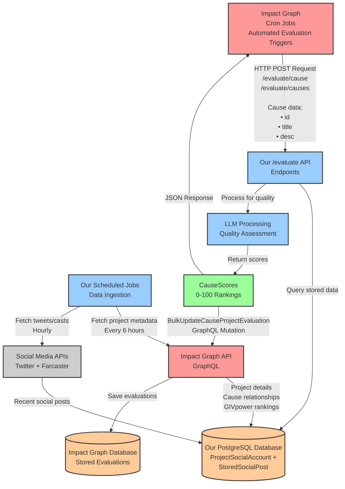

# Donation Agent Evaluator Service - Data Flow Diagram

## High-Level Overview

```mermaid
graph TD
    %% Impact Graph System
    IG[Impact Graph API<br/>GraphQL]
    IG_CRON[Impact Graph<br/>Cron Jobs<br/>Automated Evaluation Triggers]

    %% Our System
    OUR_CRON[Our Scheduled Jobs<br/>Data Ingestion]
    DB[(Our PostgreSQL Database<br/>ProjectSocialAccount +<br/>StoredSocialPost)]
    API[Our /evaluate API<br/>Endpoints]

    %% Social Media
    SOCIAL[Social Media APIs<br/>Twitter + Farcaster]

    %% Processing
    LLM[LLM Processing<br/>Quality Assessment]
    SCORES[CauseScores<br/>0-100 Rankings]
    IG_DB[(Impact Graph Database<br/>Stored Evaluations)]

    %% Data Ingestion Flow (Background)
    OUR_CRON --> |Fetch project metadata<br/>Every 6 hours| IG
    IG --> |Project details<br/>Cause relationships<br/>GIVpower rankings| DB

    OUR_CRON --> |Fetch tweets/casts<br/>Hourly| SOCIAL
    SOCIAL --> |Recent social posts| DB

    %% Evaluation Flow (On-Demand)
    IG_CRON --> |HTTP POST Request<br/>/evaluate/cause<br/>/evaluate/causes<br/><br/>Cause data:<br/>• id<br/>• title<br/>• desc| API
    API --> |Query stored data| DB
    API --> |Process for quality| LLM
    LLM --> |Return scores| SCORES
    SCORES --> |JSON Response| IG_CRON
    SCORES --> |BulkUpdateCauseProjectEvaluation<br/>GraphQL Mutation| IG
    IG --> |Save evaluations| IG_DB


    %% Styling
    classDef impactGraph fill:#ff9999,stroke:#333,stroke-width:2px
    classDef ourSystem fill:#99ccff,stroke:#333,stroke-width:2px
    classDef database fill:#ffcc99,stroke:#333,stroke-width:2px
    classDef external fill:#cccccc,stroke:#333,stroke-width:2px
    classDef output fill:#99ff99,stroke:#333,stroke-width:2px

    class IG,IG_CRON impactGraph
    class OUR_CRON,API,LLM ourSystem
    class DB,IG_DB database
    class SOCIAL,CLIENT external
    class SCORES output
```

## Detailed Data Flow Diagram

```mermaid
graph TD
    %% External Systems
    IG["Impact Graph API<br/>GraphQL Endpoint"]
    TC["Twitter API<br/>Cookie/Password Auth"]
    FC["Farcaster APIs<br/>FName Registry + Warpcast<br/>FREE - No API Keys"]
    OR["OpenRouter API<br/>Gemini 2.5 Flash"]

    %% Cron Job System
    CS["Cron Scheduler<br/>Main: Every Hour<br/>Jobs: Every 10min"]

    %% Job Types
    PSJ["Project Sync Jobs<br/>Every 6 hours<br/>Batch: 15 projects<br/>Concurrency: 3"]
    TFJ["Twitter Fetch Jobs<br/>Hourly distribution<br/>Rate: 4-8s delays<br/>Incremental fetch"]
    FFJ["Farcaster Fetch Jobs<br/>Hourly distribution<br/>Rate: 2-3s delays<br/>Incremental fetch"]

    %% Core Services
    DFS["DataFetchingService<br/>150s timeout<br/>Retry logic"]
    TSS["TwitterService<br/>Dual auth strategy<br/>Rate limiting<br/>Cookie persistence"]
    FSS["FarcasterService<br/>FID resolution<br/>Transfer handling<br/>Intelligent caching"]

    %% Database Entities
    PSA[("ProjectSocialAccount<br/>Entity")]
    SSP[("StoredSocialPost<br/>Entity")]

    %% API Endpoints
    EC["/evaluate/cause<br/>Single cause evaluation"]
    ECS["/evaluate/causes<br/>Multiple causes batch"]
    ED["/evaluate/evaluation-detailed<br/>CSV reports"]

    %% Processing Services
    ES["EvaluationService<br/>Main orchestrator"]
    SS["ScoringService<br/>Weighted calculation"]
    LS["LLMService<br/>Quality assessment"]

    %% Data Flow: Scheduled Jobs
    CS --> PSJ
    CS --> TFJ
    CS --> FFJ

    %% Data Ingestion Flow
    PSJ --> DFS
    DFS --> IG
    IG --> DFS
    DFS --> PSA

    TFJ --> TSS
    TSS --> TC
    TC --> TSS
    TSS --> SSP

    FFJ --> FSS
    FSS --> FC
    FC --> FSS
    FSS --> SSP

    %% API Request Flow
    CLIENT["Client Request"] --> EC
    CLIENT --> ECS
    CLIENT --> ED

    %% Evaluation Processing
    EC --> ES
    ECS --> ES
    ED --> ES

    ES --> DFS
    ES --> PSA
    ES --> SSP

    ES --> SS
    SS --> LS
    LS --> OR
    OR --> LS
    LS --> SS

    %% Scoring Components
    SS --> SC1["Project Info Quality: 15%<br/>LLM Assessment"]
    SS --> SC2["Update Recency: 10%<br/>Calculated Decay"]
    SS --> SC3["Social Media Quality: 10%<br/>Twitter 50% + Farcaster 50%<br/>LLM Assessment"]
    SS --> SC4["Social Posting Recency: 5%<br/>Calculated"]
    SS --> SC5["Social Posting Frequency: 5%<br/>Calculated"]
    SS --> SC6["Relevance to Cause: 20%<br/>Twitter 33% + Farcaster 33% + Project 33%<br/>LLM Assessment"]
    SS --> SC7["Evidence of Impact: 20%<br/>LLM Assessment"]
    SS --> SC8["GIVpower Rank: 15%<br/>From Impact Graph"]

    %% Final Output
    SC1 --> SCORE["Final CauseScore<br/>0-100 weighted sum"]
    SC2 --> SCORE
    SC3 --> SCORE
    SC4 --> SCORE
    SC5 --> SCORE
    SC6 --> SCORE
    SC7 --> SCORE
    SC8 --> SCORE

    SCORE --> CSV["CSV Logging<br/>Detailed audit trail"]
    SCORE --> RESP["API Response<br/>Sorted project rankings"]


    %% Error Handling & Monitoring
    EH["Error Handling<br/>Graceful degradation<br/>Correlation IDs<br/>Retry logic"]
    SS -.-> EH
    TSS -.-> EH
    FSS -.-> EH
    DFS -.-> EH

    %% Styling
    classDef externalAPI fill:#ff9999,stroke:#333,stroke-width:2px
    classDef cronJob fill:#99ccff,stroke:#333,stroke-width:2px
    classDef service fill:#99ff99,stroke:#333,stroke-width:2px
    classDef database fill:#ffcc99,stroke:#333,stroke-width:2px
    classDef endpoint fill:#cc99ff,stroke:#333,stroke-width:2px
    classDef scoring fill:#ffff99,stroke:#333,stroke-width:2px
    classDef output fill:#ff99ff,stroke:#333,stroke-width:2px

    class IG,TC,FC,OR externalAPI
    class CS,PSJ,TFJ,FFJ cronJob
    class DFS,TSS,FSS,ES,SS,LS service
    class PSA,SSP database
    class EC,ECS,ED endpoint
    class SC1,SC2,SC3,SC4,SC5,SC6,SC7,SC8 scoring
    class SCORE,CSV,RESP,CACHE,EH output
```
